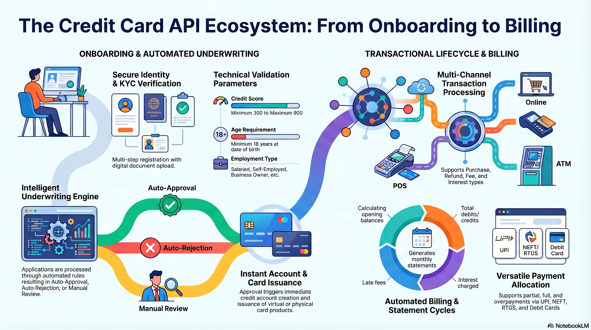
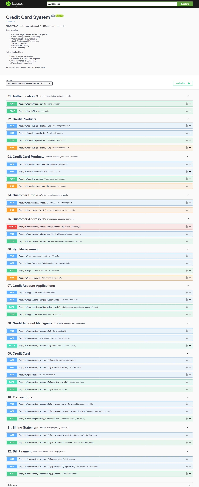

# 💳 Credit Card Issuing and Management System

-

<h2 align="center">
  Backend system simulating real-world credit card processing (authorization, ledger, billing, payments)
</h2>

<p align="center">
  
  
  
  
  
  
  
</p>

<p align="center">
  
  
</p>

<p align="center">
  
</p>

## 📌 Overview

The **Credit Card Issuing and Management System** is a backend application built using **Spring Boot** that simulates a **real-world credit card issuing and processing platform**.

The system models core financial workflows including:

- Credit card application & underwriting  
- Card issuance & lifecycle management  
- Transaction processing with authorization lifecycle  
- Ledger-based accounting (source of truth)  
- Billing cycle & statement generation  
- Interest calculation on revolving balances  
- Payment processing with allocation logic  
- Scheduled jobs for automated billing & due evaluation  

---

## 🛠 Tech Stack
--
- Java 17  
- Spring Boot  
- Spring Security + JWT Authentication  
- Spring Data JPA  
- PostgreSQL  
- Flyway (Database Migration)  
- Swagger / OpenAPI  
- Maven  
- JUnit & Mockito  
- Caffine Cache

---

## 🚀 Key Features

### 🔐 Authentication & Security

- User registration and login  
- JWT-based authentication  
- Role-based access control (Customer / Admin)  

---

### 👤 Customer & KYC Management

- Create and update customer profiles  
- Manage customer addresses  
- KYC submission and verification  
- Enforced KYC validation before credit application  

---

### 💳 Credit Card Application & Underwriting

- Credit card application submission  
- Validation rules:
  - KYC must be approved  
  - Credit score validation (300–900)  
  - Duplicate application prevention  
  - Active application limit  
  - Rejection cooldown enforcement  
- Integration with underwriting engine  
- Auto account creation on approval  

---

### 🏦 Credit Account Management

- Credit account creation from approved applications  
- Account lifecycle:
  - ACTIVE → SUSPENDED → BLOCKED → CLOSED  
- Ownership validation for customers  
- Admin-level account management  
- Credit limit enforcement  

---

### 💳 Card Issuance & Lifecycle

- Issue credit cards (customer & admin flows)  
- Supports:
  - Virtual cards  
  - Physical cards (address required)  
- Constraints:
  - Max cards per account  
  - Virtual card uniqueness  
- Card lifecycle:
  - PENDING → ACTIVE → BLOCKED / EXPIRED / CANCELLED  
- Secure ownership validation  

---

### 💸 Transaction Processing Engine

- Supports:
  - Purchases  
  - Refunds  
- Validation pipeline:
  - Card status & expiry  
  - Channel validation (ATM / POS / ONLINE)  
  - Daily spend limits  
  - Credit limit validation using ledger  
- Authorization-based processing (HOLD → CAPTURE)  
- Declined transactions are persisted (audit compliance)  
- Pagination & filtering support  

---

### 🏦 Authorization Lifecycle

- AUTHORIZE → Reserve credit (hold)  
- CAPTURE → Finalize transaction  
- EXPIRE / REVERSE → Release unused holds  

Key behaviors:
(But here i have not completely implemented the feature, Now Authorization and capture is happening at same time by internal api call 
- Holds reduce available credit  
- Ledger updated only after capture  
- Idempotency via network reference  

---

### 📒 Ledger System (Financial Core)

- Append-only ledger (immutable entries)  
- Entry types:
  - DEBIT → increases outstanding balance  
  - CREDIT → reduces outstanding balance  

**Balance Formula:**


Balance = Credits - Debits


- Acts as the **single source of truth**  

---

### 📊 Billing & Statement Engine

- Automatic & manual statement generation  
- Timezone-aware billing cycles  
- Prevents duplicate statements  
- Calculates:
  - Opening balance  
  - Transactions  
  - Interest  
  - Minimum due  
- Statement statuses:
  - PAID  
  - REVOLVING  
  - OVERDUE  
- Late fee handling  

---

### 📈 Interest Calculation Engine

- Daily interest calculation (APR → Daily Rate)  
- Time-segmented based on ledger entries  
- Grace period support  
- Accurate rounding using BigDecimal 
- Here i used Simple interest so the interest accumulation is not as per the industry standard which will be implemented later 

---

### 💰 Payment Processing System

- Idempotent payment handling  
- FIFO allocation across statements  
- Supports:
  - Partial payments  
  - Multi-statement payments  
  - Over-payments  
- Updates:
  - Ledger  
  - Statements  
  - Account balance  

---

### ⏰ Scheduled Billing & Automation

#### Daily Jobs (UTC)

**1. Statement Generation (00:00)**  
- Generates statements based on billing cycle day  
- Handles duplicate prevention  

**2. Due Date Evaluation (00:15)**  
- Evaluates:
  - PAID  
  - REVOLVING  
  - OVERDUE  
- Applies late fees  

---

## 🧱 Project Structure

```text
src/main/java/com/example
│
├── api                 # API contracts / interfaces
├── audit               # Auditing (logging, tracking)
├── config              # Configuration (beans, properties)
├── controller          # REST controllers
│
├── dto
│   ├── request         # Incoming API payloads
│   └── response        # Outgoing API responses
│
├── entity              # JPA entities
├── enums               # Domain enums
├── exception           # Custom exceptions
├── idempotency         # Idempotency handling
├── mapper              # Entity ↔ DTO mapping
├── repository          # JPA repositories
├── security            # JWT & security config
│
├── service             # Service interfaces
├── service/ServiceImpl # Business logic implementations
│
├── specification       # JPA Specifications (filters)
│
├── underwriting
│   └── model           # Underwriting models
│
└── util                # Utilities (generators, schedulers)
```

## Resources Structure

```text
src/main/resources
│
├── db                  # Flyway migrations
├── META-INF            # Metadata
├── static              # Static files
├── templates           # Templates
│
├── application.properties
├── application-example.properties
└── application-test.properties
```

## Test Resource

```text
src/test/java          # Unit & integration tests
src/test/resources     # Test configurations
```

## 🗄 Database Migrations

Managed using Flyway


```
src/main/resources/db/migration
```


Includes:

- Customer & authentication  
- KYC  
- Credit products  
- Accounts  
- Cards  
- Transactions  
- Ledger  
- Billing  
- Payments  

---

## ⚙️ Running the Project

### 1. Clone


```
git clone https://github.com/your-username/credit-card-system.git
```

```
cd credit-card-system
```

---

### 2. Configure the Database

Create a PostgreSQL database:

```
credit_card_system
```

Update configuration in `application.properties`.

---

### 3. Run the Application

```
mvn spring-boot:run
```

Application runs on:

```
http://localhost:8082
```

---

## 📘 API Documentation

Swagger UI:

```
http://localhost:8082/swagger-ui/index.html
```

---

## 🧪 Testing

Run tests using:

```
mvn test
```

---

## API Documentation

Swagger UI is available at:

http://localhost:8082/swagger-ui/index.html

Example API endpoints:

* POST /api/auth/register
* POST /api/auth/login
* GET /api/credit-products
* POST /api/credit-account-applications

## 📸 Screenshots
---

<p align="center">
  
</p>


## 🧱 Architecture

## Architecture

The application follows a layered architecture:

### Controller Layer
Handles HTTP requests and responses.

### Service Layer
Contains business logic.

### Repository Layer
Handles database interaction using Spring Data JPA.

### Security Layer
Manages authentication and authorization using JWT.

### Underwriting Engine
Evaluates credit card applications using configurable rules and risk scoring.
 

### Core Modules

- User Authentication
- Product Configuration
- Credit Account and Under-writting Rule engine
- Credit Card Issuing 
- Authorization  
- Transaction  
- Ledger  
- Billing  
- Payment  

---

## 🔄 Core Financial Flows

### Transaction Flow

Request → Authorization (HOLD)
→ Transaction Creation
→ Ledger Update
→ Capture


### Billing Flow

Ledger → Statement → Interest → Due Calculation


### Payment Flow

Payment → Ledger → Allocation → Account Update


## ✅ Features Implemented

* JWT Authentication  
* Role-Based Access Control  
* Credit Card Application Workflow  
* Underwriting System  
* Credit Account Management  
* Card Issuance & Life-cycle  
* Transaction Processing Engine  
* Authorization (Hold and Capture) --> Instantly 
* Ledger-Based Accounting  
* Billing & Statement Engine  
* Interest Calculation  
* Payment Processing & Allocation  
* Scheduled Jobs  
* RESTful APIs  
* Unit Testing  
* Integration Testing
---

## 👨‍💻 Author

**Vivekananda Giri**  
Software Engineer | Backend Developer | Java & Spring Boot  

---